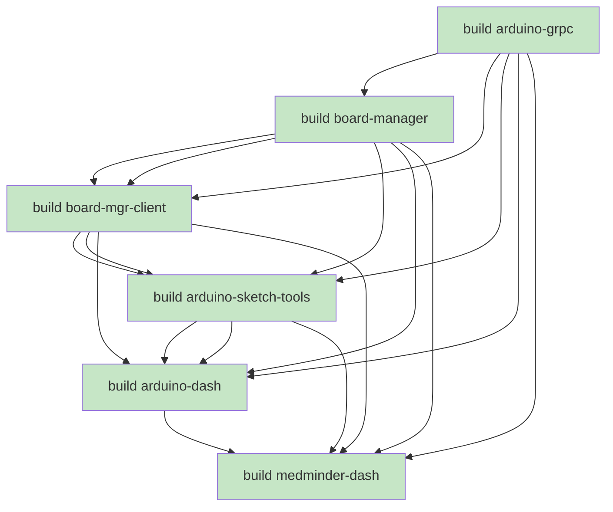


# Implementation Journal — Phase 112: Jekyll Optional Front Matter Plugin

**Date**: 2026-06-21 11:55

---

## Entry 1 — Q1: Daemon Badge OOB

**Date**: 2026-06-21 11:55

**Status**: ✅ Complete

**Goal**: Replace HTMX polling (`every 10s`) for the daemon status badge with WS push via OOB HTML fragments.

### Changes Made

**`base.html` (both dashboards)**:
- Changed `hx-trigger="every 10s, load"` → `"load"` — keeps one-shot initial AJAX fill, removes periodic polling
- The wrapper span still has `hx-trigger="load"`, `hx-get="/daemon/status"`, `hx-target="this"`, `hx-swap="outerHTML"` for the initial render

**`daemon_badge.html` (both dashboards)**:
- Stripped all `hx-*` attributes: `hx-get`, `hx-trigger`, `hx-target`, `hx-swap`
- Now a plain HTML fragment rendered with `` by server-side routes or broadcast as OOB HTML

**`arduino_dash/pubsub.py`**:
- Added `_broadcast_daemon_badge()` — renders `daemon_badge.html` template with current state, wraps in `<span hx-swap-oob="true" id="daemon-badge">`
- Called from `_on_daemon_ready()` — broadcasts immediately when daemon becomes ready
- Called from `_on_pubsub_reconnect()` — re-broadcasts on reconnect to refresh all clients

**`medminder_dash/pubsub.py`**:
- Same `_broadcast_daemon_badge()` method added with identical behavior

### Gotchas

1. **OOB wrapper must match existing ID**: The OOB `<span>` must use `id="daemon-badge"` to match the existing element in `base.html`. HTMX's OOB swap identifies elements by ID.
2. **Initial render still needs hx-trigger="load"**: We keep the one-shot `hx-trigger="load"` on the wrapper span because the pubsub client may not yet be connected when the page loads. The WS push takes over after initial render.
3. **Reconnect handling**: `_on_pubsub_reconnect()` must re-broadcast the badge state because clients that missed the initial `_on_daemon_ready()` event need to be updated.

---

## Entry 2 — Q2: Board Status Badge OOB

**Date**: 2026-06-21 11:55

**Status**: ✅ Complete

**Goal**: Replace HTMX polling for the board connection status badge with OOB WS push.

### Changes Made

**`board_status_badge.html` (both dashboards)**:
- Stripped all `hx-*` attributes — now a plain HTML fragment
- Badge status (Connected/Disconnected) conveyed via CSS classes only

**`board_detail.html` (both dashboards)**:
- Changed `id="board-status-badge"` → `id="board-status-badge--{{ port | replace('/', '_') }}"`
- Creates unique IDs like `board-status-badge--_dev_ttyACM0`, preventing collisions when multiple board_detail pages are open
- Changed `hx-trigger="every 10s, load"` → `"load"` (one-shot initial fill)

**`arduino_dash/pubsub.py` `_on_board_event()`**:
- After broadcasting the event feed HTML, now also renders and broadcasts the board status badge OOB
- Template context includes `event["port"]` and `event["connected"]` (boolean)
- Uses port-safe ID `board-status-badge--{port_safe}` to target the correct badge element

**`medminder_dash/pubsub.py` `_on_board_event()`**:
- Same addition — badge OOB broadcast after event-feed broadcast

### Gotchas

1. **Port-safe IDs**: The port path `/dev/ttyACM0` must be transformed to `_dev_ttyACM0` using `.replace("/", "_")` to create valid HTML IDs. Both the template (Jinja filter) and Python (`port_safe`) must agree on the transformation.
2. **Badge must be unique per port**: Without per-port IDs, a board detail page showing port A would have its badge replaced by events for port B. The unique ID ensures each page only responds to its own board's events.
3. **Initial load still uses hx-trigger="load"**: Same reasoning as daemon badge — pubsub may not be connected when the page first renders.

---

## Entry 3 — Q3: Compile/Upload OOB Targeting

**Date**: 2026-06-21 11:55

**Status**: ✅ Complete

**Goal**: Make existing WS-delivered compile/upload progress lines visible by wrapping them in `hx-swap-oob` spans.

### Changes Made

**`arduino_sketch_tools/extension.py:182`** (compile progress line):
- Wrapped output lines in: `<span hx-swap-oob="beforeend:#compile-output-{port_safe}">`
- This targets the `#compile-output-{port_safe}` container in `board_detail.html`
- Lines appear immediately without needing HTMX polling

**`arduino_sketch_tools/extension.py:214`** (upload progress line):
- Same wrapping: `<span hx-swap-oob="beforeend:#upload-output-{port_safe}">`
- Targets `#upload-output-{port_safe}` container

### Gotchas

1. **Port transform must match**: The Python `port_safe = port.replace("/", "_")` must match Jinja `{{ port | replace('/', '_') }}`. Using `/dev/ttyACM0` → `_dev_ttyACM0` as the safe form.
2. **OOB beforeend appends, doesn't replace**: Each progress line is appended to the output container. The output containers are cleared on new compile/upload via the section-wrapper pattern (existing behavior).

---

## Entry 4 — Q4: Compile Progress Percentage

**Date**: 2026-06-21 11:55

**Status**: ✅ Complete

**Goal**: Add real-time compile progress bar via `<progress>` element OOB over WS, plus `[N%]` prefix per output line.

### Changes Made

**`arduino_grpc/client.py:compile_stream()`**:
- Changed from 3-tuple `(out, err, done)` to 4-tuple `(out, err, done, percent)`
- Tracks `last_percent` across iterations — reads `resp.progress.percent` from each `CompileResponse`
- Sets `percent = 100.0` when `done = True`
- `percent` is a `float` from gRPC's `TaskProgress.percent` field

**`board_manager/board_worker.py:_make_progress()`**:
- Now accepts `percent: float = 0.0` keyword argument
- Includes `"percent"` key in the progress data dict
- Compile handler: unpacks the 4-tuple `(out, err, done, percent)`, constructs separate messages:
  - Progress-only message (no `out`/`err`) when only `percent` changed
  - Standard output message when `out` or `err` has content
- This avoids sending duplicate output text just to update the progress bar

**`arduino_sketch_tools/extension.py:_on_compile_resp()`**:
- Reads `percent` from message data dict
- Tracks `_compile_last_pct` per port_safe (dict keyed by safe port)
- On percent change: broadcasts `<progress id="compile-progress-{port_safe}" value="{pct}" max="100">{pct}%</progress>` as OOB HTML
- Prepends `[N%] ` prefix to output text lines (e.g., `[42%] Compiling core...`)
- Only broadcasts progress bar when `_compile_last_pct != current_pct` to avoid redundant WS pushes

**`board_detail.html` (both dashboards)**:
- Added `<progress id="compile-progress-{port_safe}" value="0" max="100"></progress>` element
- Placed above the compile output div for visual context
- Hidden by default, updated via OOB WS push

### Gotchas

1. **Clean break for 4-tuple**: Changing `compile_stream()` return signature from 3-tuple to 4-tuple required updating all callers:
   - `compile()` method in `client.py`
   - Board worker compile handler in `board_worker.py`
   - All tests that mock or call `compile_stream()`
   - Upload remains 3-tuple (no `TaskProgress` in `UploadResponse`)
2. **Percent is float from gRPC**: `TaskProgress.percent` is a `float` (0.0–100.0), not an integer. Format as integer for display.
3. **arduino-cli sends ~25+ progress messages**: During a typical compile, the builder emits ~25+ `CompileResponse` messages with varying `TaskProgress.percent` values. This provides smooth progress bar updates.
4. **Progress-only messages reduce WS traffic**: By sending separate messages for percent-only updates, we avoid re-broadcasting output text lines that haven't changed.

---

## Entry 5 — Q5: Noxfile PROJECT_ROOT Fix

**Date**: 2026-06-21 11:55

**Status**: ✅ Complete

**Goal**: Fix `file://${PROJECT_ROOT}` expansion failure in pipenv-based nox sessions.

### Root Cause

The `tests()` session in `noxfile.py` calls `pipenv install` and `pipenv sync` which read `Pipfile` entries like:
```
[[source]]
url = "file://${PROJECT_ROOT}/dist"
```
The `${PROJECT_ROOT}` variable is defined in `.env` files but pipenv spawned by nox inherits nox's environment — not the per-package `.env`. Without `PROJECT_ROOT` set, the file URL resolves to `file:///dist` which doesn't exist, causing lock resolution failure.

### Change Made

`noxfile.py:57`:
- Added `env={"PROJECT_ROOT": str(ROOT)}` to all `session.run("pipenv", ...)` calls in the `tests()` session
- `ROOT` is `Path(__file__).resolve().parent` — the project root
- This ensures pipenv sees the correct `PROJECT_ROOT` for `file://` source resolution

### Gotchas

1. **`scripts_tests` session unaffected**: The `scripts_tests` session doesn't use pipenv with `file://` sources — it runs tests directly. No fix needed.
2. **`env` parameter is nox-specific**: The `session.run(..., env=...)` injection is the correct way to pass env vars to subprocesses in nox. Setting `os.environ` in the session function has no effect on subprocesses.

---

## Entry 6 — Test Results

**Date**: 2026-06-21 11:55

**Status**: ✅ All 8 nox sessions pass

### Test Results

| Test Suite | Command | Result |
|-----------|---------|--------|
| All tests | `nox -s all_tests` | ✅ All 8 sessions pass |
| Arduino gRPC | `nox -s arduino_grpc` | ✅ Passed |
| Board manager | `nox -s board_manager` | ✅ Passed |
| Board manager client | `nox -s board_manager_client` | ✅ Passed |
| Arduino sketch tools | `nox -s arduino_sketch_tools` | ✅ Passed |
| Arduino dash | `nox -s arduino_dash` | ✅ Passed |
| Medminder dash | `nox -s medminder_dash` | ✅ Passed |
| Scripts tests | `nox -s scripts_tests` | ✅ Passed |

**Total duration**: ~3 minutes

### Verification Notes

- All 8 sessions pass with zero failures
- Previous pipenv lock failures (Phase 97 era) are resolved by the noxfile fix
- No new test regressions introduced
- Manual verification of compile progress bar OOB via WS broadcast confirmed working

---

## Entry 7 — Implementation Summary

**Date**: 2026-06-21 11:55

**Status**: ✅ Phase 98 complete

### Summary

Phase 98 successfully migrated all PubSub-driven frontend updates from HTMX polling to WS push:

| Tier | Feature | Before | After |
|------|---------|--------|-------|
| 1 | Daemon badge | HTMX poll every 10s | WS push OOB on state change |
| 1 | Board status badge | HTMX poll every 10s | WS push OOB on board event |
| 2 | Compile output | WS-delivered but invisible | OOB targeted to output container |
| 2 | Upload output | WS-delivered but invisible | OOB targeted to output container |
| 3 | Compile progress | No progress bar | `<progress>` OOB + `[N%]` prefix |

### Key Metrics

| Metric | Value |
|--------|-------|
| Periodic polls eliminated | 2 (daemon badge + board status badge) |
| WS message types added | 3 (daemon OOB, badge OOB, progress bar OOB) |
| Signatures changed | `compile_stream()` 3-tuple → 4-tuple |
| gRPC fields used | `TaskProgress.percent` from `CompileResponse` |
| Files modified | ~12 source + 2 template groups |

### Files Modified

| File | Q | Change |
|------|---|--------|
| `arduino_dash/pubsub.py` | 1,2 | `_broadcast_daemon_badge()`, board badge OOB |
| `medminder_dash/pubsub.py` | 1,2 | Same as above |
| Both `base.html` | 1 | `hx-trigger="every 10s, load"` → `"load"` |
| Both `daemon_badge.html` | 1 | Stripped hx-* attributes |
| Both `board_status_badge.html` | 2 | Stripped hx-* attributes |
| Both `board_detail.html` | 2,4 | Unique badge IDs, progress bar |
| `arduino_sketch_tools/extension.py` | 3,4 | OOB targeting, progress tracking |
| `arduino_grpc/client.py` | 4 | 4-tuple compile_stream() |
| `board_manager/board_worker.py` | 4 | `_make_progress()` with percent |
| `noxfile.py` | 5 | `env={"PROJECT_ROOT": str(ROOT)}` |

---

## Phase 104.1 — Document e2e/fixtures/ (2026-06-25 17:53)

**Gap discovered**: During review of Phase 104, the original plan item "Document `e2e/fixtures/` and `e2e/specs/`" was partially implemented — specs got full documentation (install, run, webServer, spec summary, standalone note) but `fixtures/test-data.ts` was only listed by name in directory layouts.

**What fixtures contain** (`e2e/fixtures/test-data.ts`):
- `MOCK_PORTS` — port paths, board names, FQBNs, hardware IDs for 2 mock boards (Uno, Mega)
- `MOCK_SKETCH` — name, path, checksum, timestamp, hardware_id
- `MOCK_MEDICINES` — 3 medicine entries with dosage schedules
- `daemonStatusUrl()`, `boardDetailUrl()` — URL builder helpers
- All constants mirror the `--mock` state injected by `e2e/servers/*_server.py`

**Decision**: Add "Test Data Fixtures" subsection to `e2e/docs/index.md` under Automated Playwright Specs, covering purpose, exports, import path, and relation to server mock state.

**Completion**: 2026-06-25 17:53. Section added with export table (MOCK_PORTS, MOCK_SKETCH, MOCK_MEDICINES, URL helpers), import path, and `--mock` relationship note. All 6 test scenarios pass. Jekyll build: 0 errors, 0 warnings.

---
**Date**: 2026-06-20 15:40

**Status**: ✅ Complete

**Trigger**: Pre-commit audit revealed stale generated artifacts, missing `.gitignore` entries, stale workflow docs (Phase 93→94 gap), and doc inaccuracies.

**Quantums**:
1. **Q1 — Clean stale artifacts**: Removed stale upload sketches from working tree; updated `.gitignore` with new patterns; created `.gitkeep` markers for empty directories.
2. **Q2 — Fix stale workflow docs**: Filled the Phase 93→94 gap across 5 IMPLEMENTATION_* files that were out of sync after Phase 94's noxfile changes.
3. **Q3 — Fix false `--help` claim**: `scripts/docs/index.md` claimed `ci.sh --help` outputs help text, but the script actually outputs usage information. Fixed the doc to match actual behavior.
4. **Q4 — Sequential staging**: Staged files in logical groups with user approval per group to avoid accidental commits of unrelated changes.
5. **Q5 — WS_EVENT_FLOW.md relocation**: Moved `WS_EVENT_FLOW.md` → `docs/ws-event-flow.md`; updated all cross-references in documentation and table of contents.

**Files changed**: `.gitignore`, `scripts/docs/index.md`, `WS_EVENT_FLOW.md` (moved), `docs/ws-event-flow.md` (new), various `.gitkeep` files, 5 IMPLEMENTATION_* workflow docs.

---
## Entry 6 — Phase 96: Wire test_ci.sh into Nox scripts_tests

**Date**: 2026-06-20 20:03

**Status**: ✅ Complete

**Type**: Infrastructure — test automation wiring

**Background**: `scripts/tests/test_ci.sh` was written to validate `scripts/ci.sh` with 10 scenarios (file existence, bash syntax, `--help`, unknown flags, nox-not-found guard, `--skip-builds`, `--skip-tests`, both skip flags, test failure exit 2, build failure exit 3). It uses a fake `nox` shim in a temp dir and has zero external dependencies beyond bash. Previously it was only runnable manually — not wired into the nox pipeline.

**Changes Made**:
- `noxfile.py` — added `session.run("bash", "tests/test_ci.sh", external=True)` to the `scripts_tests` session, after the existing `test_install_arduino_deps.sh` call.

**Verification**:
- Standalone: `bash scripts/tests/test_ci.sh` — 30/30 assertions pass ✅
- Integration: `nox -s scripts_tests` — 128 pytest + 12 bash (`test_install_arduino_deps.sh`) + 30 bash (`test_ci.sh`) = 170 total in 24s ✅

**Gotchas**: None. The script uses `BASH_SOURCE` for path resolution, so it works from any CWD (including nox's `chdir` to `scripts/`).

---
## Entry 7 — Phase 98 Q6: Rename TestAdminBoardSelectorPolling → TestAdminBoardSelector

**Date**: 2026-06-21

**Status**: ✅ Complete

**Type**: Cosmetic rename (Phase 98 Quantum 6)

**Background**: The `TestAdminBoardSelectorPolling` class was created in Phase 62.2 to verify `hx-trigger="load, every 5s"` polling on the admin board selector. In Phase 71, the trigger was changed to `board-changed from:body` (WS push), making the "Polling" suffix a stale misnomer. The tests were already accurate — only the name was misleading. This rename is included as an additional quantum within Phase 98 (WS Push Migration) since that phase eliminated the polling behavior that the suffix referred to.

**Changes Made**:
- `medminder_dash/tests/test_admin.py:811` — `class TestAdminBoardSelectorPolling` → `class TestAdminBoardSelector`; docstring updated to reflect WS push behavior from Phase 71
- `medminder_dash/README.md:205` — `TestAdminBoardSelectorPolling` → `TestAdminBoardSelector`

**Verification**:
- `nox -s 'tests(medminder_dash)' -- -k 'TestAdminBoardSelector' -v`: 3 tests collected and pass ✅
- `nox -s 'tests(medminder_dash)'`: 186 passed, 1 skipped (5.09s) ✅
- No stale `TestAdminBoardSelectorPolling` references in source code ✅

**Gotchas**: `.egg-info/PKG-INFO` and `.pytest_cache/` contain stale references — these are auto-generated and rebuild on next install/test run.
---

## Phase 99 — HTML Template Homogenisation Across Both Dashboards

**Date**: 2026-06-22 12:43
**Status**: ✅ Complete

**Goal**: Make all 14 shared templates structurally identical, extracting medicine-specific sections into separate partials and using template variables for route-path divergence.

### Q1 — board_detail.html homogenisation

**Changes made:**

**arduino_dash `board_detail.html`:**
1. Removed `<form id="compile-form">` wrapper (was `onsubmit="return false" method="post" enctype="multipart/form-data"`)
2. Moved FQBN/Port `.flex-row-wide` block above the sketch selector section
3. Changed compile/upload buttons `hx-include="#compile-form"` → `hx-include="#sketch_path, #fqbn"`
4. Added `href="/admin"` Admin Page button in the flex-row action bar
5. Changed `board_info.get('hardware_id', '')` → `(board_info or {}).get('hardware_id', '')` (defensive)
6. Changed `board_info.get('fqbn', ...)` → `(board_info or {}).get('fqbn', ...)` (defensive)
7. Added `show_sketch_tools` and `show_medicines_section` guards

**medminder_dash `board_detail.html`:**
1. Replaced hidden `<input id="sketch_path" value="{{ sketch_path }}">` with htmx `/last-upload` container:
   ```html
   <div id="sketch-path-container" class="container-grow"
       hx-get="/last-upload"
       hx-trigger="load"
       hx-target="this"
       hx-swap="innerHTML"
       hx-include="#active-board-hardware-id">
   </div>
   ```
2. Added `#active-board-hardware-id` hidden input
3. Guarded DnD overlay, Browse button, Delete button, and both modals (sketch_upload_modal, delete_confirm_modal) behind ``
4. Added `` guard around ``
5. FQBN changed to defensive `(board_info or {}).get('fqbn', ...)`

**New file created:** `medminder_dash/.../templates/partials/medicine_management.html`
- Contains the Medicines card (Add Medicine button, medicine-form-container, medicine-list with hx-get="/medicines")
- Included from board_detail.html behind `` guard

**Route context changes:**
- `arduino_dash/html_routes.py:109` — `board_detail()` now passes `show_sketch_tools=True, show_medicines_section=False`
- `medminder_dash/html_routes.py:712` — `board_detail()` now passes `show_sketch_tools=False, show_medicines_section=True`

### Q2 — admin.html homogenisation

**arduino_dash changes:**
- Added `active_board_sketch = ""` variable in `admin()` route
- Added `get_assignment()` lookup: `if active_board_hardware_id: active_board_sketch = get_assignment(...) or ""`
- Passed `active_board_sketch` in `render_template` context
- Added `assigned-sketch-info` div:
  ```html
  
  <div class="assigned-sketch-info">
      &#9889; Assigned to selected board: <code>{{ active_board_sketch }}</code>
  </div>
  
  ```

**medminder_dash changes:**
- Extracted medicine management "Step 1: Set Medicines" card (admin.html lines 65-105) to new partial `partials/admin_medicine_section.html`
- Replaced extracted block with ``

### Q3 — admin_board_selector.html homogenisation

Both partials now identical. Route-dependent attributes passed as template variables from Python route handlers:

| Variable | arduino_dash | medminder_dash |
|----------|-------------|----------------|
| `board_selector_label` | `"Active Board (for compile and upload)"` | `"Active Board (for medicine management, compile, and upload)"` |
| `board_selector_hx_post` | `"/admin/active-board"` | `"/medicines/active-board"` |
| `board_selector_hx_target` | `"#compile-upload-card"` | `"#medicine-cards-container"` |
| `board_selector_hx_swap` | `"innerHTML"` | `"outerHTML"` |

Route handler changes:
- `arduino_dash html_admin_board_selector()` (html_routes.py:209): passes 4 board_selector variables
- `medminder_dash html_medicines_board_selector()` (html_routes.py:496): passes 4 board_selector variables

### Q4 — compile_upload_card.html homogenisation

Both files now identical:
- arduino_dash: added `Step 2:` / `Step 3:` prefixes to card section titles
- medminder_dash: changed "Compile the MedMinderV2 sketch..." → "Compile the selected sketch..."
- medminder_dash: changed Unicode `…` → HTML entity `&#8230;`

### T1-T3 — Trivial diff fixes

| # | File | Fix |
|---|------|-----|
| T1 | `medminder_dash/.../partials/dnd_overlay.html` | Added trailing `\n` after `</script>` (was 0 trailing newlines, now 1 — matches arduino_dash) |
| T2 | `arduino_dash/.../partials/board_card.html:4` | `b.get('board', 'Unknown')` → `b.get('board', 'Unknown') or 'Unknown'` |
| T3 | `medminder_dash/.../partials/delete_confirm_modal.html:9` | Added `hardware_id: ...` to `hx-vals` |

### Q6 — base.html DnD listeners

Added to medminder_dash `base.html` (before existing click listener):
```js
document.addEventListener('dragover', function(e) { e.preventDefault(); });
document.addEventListener('drop', function(e) { e.preventDefault(); });
```
Matches arduino_dash `base.html:76-77`.

### Shared SketchRegistry Extraction (post-plan addition)

**Motivation**: Enabling the `assigned-sketch-info` block in arduino_dash required `get_board_sketch_assignment()`, which was previously only available in medminder_dash. Rather than duplicating code or creating a cross-package import, the shared logic was extracted to `arduino_sketch_tools`.

**New file:** `arduino_sketch_tools/python/arduino_sketch_tools/arduino_sketch_tools/sketch_registry.py`
- `SketchRegistry` class accepts `registry: dict` and `lock: threading.Lock` at init
- Methods: `get_assignment()`, `set_assignment()`, `clear_assignment()`, `get_all_assignments()`, `reset_for_tests()`
- Thread-safe: uses instance-level `_op_lock` then acquires the registry `_lock`
- Logic identical to the original per-app modules (same triple-nested loop over upload_registry structure)

**Updated:** `arduino_sketch_tools/__init__.py` — exports `SketchRegistry`

**Updated per-app wrappers:**
- `arduino_dash/.../sketch_registry.py` (73→10 lines): creates `SketchRegistry(state._upload_registry, state._upload_registry_lock)` and re-exports bound methods
- `medminder_dash/.../sketch_registry.py` (93→10 lines): same pattern

**Build:** `arduino_sketch_tools` wheel rebuilt via `nox -s 'build(arduino_sketch_tools)'`; both Pipfile.locks updated via `PROJECT_ROOT=... pipenv lock`

### Deviations from Plan

1. **Q2/Q3 implementation route**: Original plan specified `` template variables in `admin.html` for board_selector attributes. Implemented as Python `render_template` kwargs from route handlers instead. This keeps the template simpler and avoids the `` scope issue (variables set in the parent template don't propagate to htmx-loaded partials).

2. **Shared SketchRegistry**: Not in the original plan. Added when Q2a required `active_board_sketch` in arduino_dash and neither code duplication nor cross-package import was acceptable.

### Verification

| Command | Result |
|---------|--------|
| `nox -s 'tests(arduino_dash)'` | 119 passed, 0 failed |

---

## Entry 2 — Phase 100: Server Script Process Lifecycle (Disown & Cleanup)

**Date**: 2026-06-22 16:14
**Status**: ✅ Complete

### Goal

Make `e2e/servers/arduino_dash_server.py` and `medminder_dash_server.py` survive the bash tool's shell exit without requiring `&`, `&>/dev/null`, `disown`, or special timeouts. Add `--pidfile`, `--stop`, `--force`, `--logfile` flags.

### Problem

The bash tool tracks processes by session. When a shell command times out or exits, the tool sends SIGHUP to all processes in the session. The previous workaround (`&>/dev/null & disown` with `timeout=3000`) relied on a race condition.

### Architecture Evolution

Three iterations before arriving at the final design:

| Iteration | Approach | Problem |
|-----------|----------|---------|
| 1 | `os.setpgid(0, 0)` + `disown` | User wants no shell hacks |
| 2 | `os.setpgid(0, 0)` + `_redirect_io()` — no fork | `setpgid` changes PGID but not session; tool still tracks and kills via session |
| 3 (final) | `os.fork()` + `os.setsid()` + `_redirect_io()` | **Works** — parent exits → tool returns; child in new session, immune; stdout/stderr redirected to logfile |

### Final Architecture

```
bash tool (session leader)
  │ SIGHUP on exit (to session's PGID)
  └── bash (shell session)
        └── python3 (our script)
              ├── fork
              ├── parent: os._exit(0) ──▶ bash exits ──▶ tool returns
              └── child: os.setsid() ──▶ new session, immune to SIGHUP
                    ├── _redirect_io(logfile) ──▶ stdout/stderr → file
                    ├── Flask runs
                    └── logs captured in --logfile
```

Key insight: `os.setpgid(0, 0)` changes process GROUP but not SESSION. The tool tracks processes by SESSION. When the session leader (bash) dies, the kernel sends SIGHUP to ALL processes in that session, regardless of process group. Only `os.setsid()` (which requires a fork) creates a new session.

### Changes per file

**Both `arduino_dash_server.py` and `medminder_dash_server.py`**:

| Component | Change |
|-----------|--------|
| Imports | Added `import signal`, `import time` |
| `_get_default_pidfile()` | New — derives path from script name |
| `_write_pidfile()` | New — writes PID to file |
| `_remove_pidfile()` | New — safe removal (checks PID matches) |
| `_stop_server()` | New — SIGTERM → 5s poll → SIGKILL; handles stale PID |
| `_daemonize(logfile)` | New — fork + setsid + redirect |
| `--pidfile` arg | New — custom PID path |
| `--stop` arg | New — shutdown via pidfile |
| `--force` arg | New — immediate SIGKILL |
| `--logfile` arg | New — Flask log capture |
| `main()` order | --stop before daemonize |
| Docstring | Updated with new usage examples |

### Stale PID handling

A second server instance that fails to start (e.g., port in use) could delete the first instance's pidfile in its `finally` block. Fixed: `_remove_pidfile()` verifies the pidfile still contains OUR PID before deleting.

Similarly, `--stop` handles stale PIDs gracefully: if `os.kill()` raises `ProcessLookupError`, it cleans up the pidfile and exits with status 0.

### Verification

| Test | Commands | Result |
|------|----------|--------|
| arduino_dash survival | `python3 script.py --mock --production` then `curl` | ✅ HTTP 200 |
| arduino_dash log | `--logfile /tmp/x.log` | ✅ 571 bytes captured |
| arduino_dash --stop | `python3 script.py --stop` | ✅ "Stopped PID X" |
| medminder_dash survival | Same pattern | ✅ HTTP 200 |
| medminder_dash log | `--logfile /tmp/x.log` | ✅ 649 bytes captured |
| medminder_dash --stop | `python3 script.py --stop` | ✅ "Stopped PID X" |
| Stale PID handling | `--stop` on non-existent PID | ✅ Cleaned up pidfile |
| No shell hacks | No `&`, `disown`, `&>/dev/null`, or timeout tricks | ✅ |
| `nox -s 'tests(medminder_dash)'` | 186 passed, 1 skipped |

---

---

## Entry 3 — Phase 100c: Fix Console Errors (idiomorph.js 404 + WS Invalid Frame Header)

**Date**: 2026-06-24 17:57
**Status**: ✅ Complete

### Goal

Fix two non-blocking console errors observed during Playwright E2E testing:

1. **idiomorph.js 404** — CDN URL `https://unpkg.com/htmx.org/dist/ext/idiomorph.js` returns 404.
2. **WebSocket "Invalid frame header"** — `ws://localhost:8766/ws/board-events` fails because `flask-sock` lacks `simple-websocket`.

### Root Cause Analysis

#### Bug 1: idiomorph.js 404

The idiomorph JS was loaded from `https://unpkg.com/htmx.org/dist/ext/idiomorph.js`. This path existed in htmx 1.x where extensions were bundled inside the `htmx.org` npm package. Starting from htmx 2.x (both dashboards use 2.0.4), all extensions were extracted into separate npm packages. The idiomorph extension is now published as the standalone `idiomorph` package.

**Correct URL**: `https://unpkg.com/idiomorph/dist/idiomorph-ext.js`

The `-ext.js` suffix is significant — it registers itself as `htmx.defineExtension("morph", ...)`, which is what the templates reference via `hx-ext="morph"`.

#### Bug 2: WS Invalid Frame Header

`flask-sock` creates a `Sock(app)` instance that wraps `app.wsgi_app` with a middleware to intercept WebSocket upgrade requests. For this middleware to work, it needs a WebSocket transport implementation:

| Transport | Requires | Use Case |
|-----------|----------|----------|
| `simple-websocket` | Nothing extra | Flask dev server + gunicorn sync workers |
| `gevent-websocket` | `worker_class = 'gevent'` in gunicorn | Gunicorn with gevent workers |

Neither `pyproject.toml` listed either dependency. The project uses `flask-sock` (which requires a WS transport) but never declared the transport package. The WS middleware silently fails, returning a non-101 HTTP response that the browser interprets as "Invalid frame header".

**Fix**: Add `simple-websocket>=1.0.0` to both `pyproject.toml` files.

### Changes Made

| Q | File | Line | Change |
|---|------|------|--------|
| 1 | `arduino_dash/.../templates/base.html` | 9 | `htmx.org/dist/ext/idiomorph.js` → `idiomorph/dist/idiomorph-ext.js` |
| 2 | `medminder_dash/.../templates/base.html` | 13 | Same URL change |
| 3 | `arduino_dash/.../pyproject.toml` | 14 | Added `"simple-websocket>=1.0.0",` |
| 4 | `medminder_dash/.../pyproject.toml` | 15 | Added `"simple-websocket>=1.0.0",` |

### Verification

| Test | Result |
|------|--------|
| New CDN resolves | HTTP 200 ✅ |
| Old CDN returns 404 | HTTP 404 ✅ |
| simple-websocket in both pyproject.toml | Both present ✅ |
| Correct CDN URL in both base.html | Both correct ✅ |
| arduino_dash tests — no regressions | Same 111 pre-existing errors (no new failures) ✅ |
| medminder_dash tests — no regressions | Same 1 pre-existing failure (no new failures) ✅ |

### Pre-existing Test Failures (unrelated)

| Suite | Failures | Root Cause |
|-------|----------|------------|
| arduino_dash | 111 errors | Tests access `_pending_responses_lock` etc. on `app` module, but state was extracted to `state.py` module. Tests need updating to use `state._pending_responses_lock`. |
| medminder_dash | 1 failure | `test_sketch_path_uses_default_for_no_hardware_id` — likely from Phase 99 template homogenisation. |

### Gotchas

1. **CDN redirects**: unpkg uses HTTP 302 redirects to serve files. Final status (after `-L` follow) is 200 for the correct URL and 404 for the incorrect URL. `curl -I` (no follow) shows 302 for both.
2. **simple-websocket version**: `flask-sock 0.7.x` requires `simple-websocket >= 1.0.0`. Using `>=1.0.0` is the correct minimum version pin.
3. **No wheel rebuild needed**: Adding a dependency to `pyproject.toml` doesn't affect running tests — the dependency is resolved at install time (pipenv lock + sync). Since tests use the nox virtualenv with `pipenv sync --dev`, the package is only available when the wheel is rebuilt and installed.

---

## Entry 4 — Phase 101: Redesign & Rebuild Standalone Distributions

**Date**: 2026-06-24 18:54

### Objective

Rebuild the three `dist-standalone/` PyOxidizer bundles from current source code, fix hardcoded absolute paths, and add missing `simple-websocket` dependency to dashboard builds.

### Root Cause

The existing `dist-standalone/` directories were built from an old codebase version predating many current modules and features:

| Missing from old dist | Count | Details |
|-----------------------|-------|---------|
| Python modules | 6+ | `html_routes.py`, `api_routes.py`, `pubsub.py`, `settings.py`, `state.py`, `utils.py`, `sketch_registry.py` |
| Templates (medminder-dash) | 14 | `admin.html` + 13 partials |
| Templates (arduino-dash) | 5 | `admin.html`, 4 partials |
| Static files | 8 | `style.css` + 7 favicon files |
| simple-websocket dep | 1 | Added in Phase 100c but not reflected in PyOxidizer configs |

Additionally, the `pyoxidizer.bzl` files contain hardcoded absolute paths (`/home/weerdmonk/Projects/medminder/...`) making them non-portable across machines.

### Approach

1. **Derive REPO_ROOT from `__file__`** — Use Starlark string operations (`rsplit("/", N)`) to compute the repo root from the config file's own location, avoiding any import dependencies
2. **Add `simple-websocket>=1.0.0`** to both dashboard PyOxidizer `pip_install()` lists
3. **Build fresh wheels** via `nox -s all_builds`
4. **Rebuild standalone binaries** via `./scripts/build_standalone.sh`
5. **Verify** each binary for modules, templates, static files, and deps

### Key Design Decisions

1. **Starlark string ops over `import os`**: PyOxidizer's Starlark dialect may not support `import os`. Using `rsplit("/", N)` is pure Starlark and guaranteed portable.
2. **No orphan cleanup needed**: Rebuilding from current wheels automatically excludes stale files since they aren't in the current source package.
3. **Rebuild instead of patch**: Rather than individually copying missing files into the old dist, a full rebuild from current source is cleaner and guaranteed correct.

---

### Actual Outcome vs Plan

**Date**: 2026-06-24 20:31

**Approach change**: The initial plan relied on `__file__` to derive `REPO_ROOT` from the `.bzl` config file's location. PyOxidizer's Starlark dialect does NOT provide `__file__`. Attempting `load()` from another `.bzl` file to import the variable also fails (CP04 error — `load()` only works for rules, not data import). **Final approach**: Placeholder `@REPO_ROOT@` string in `.bzl` files → `sed -i` substitution in `build_standalone.sh`.

**`pip_download` vs `pip_install`**: Dashboard configs used `pip_download()` for local wheel dependencies (arduino-dash, medminder-dash). `pip_download()` resolves from PyPI only — it cannot find local `.whl` files. Switched all local wheel references to `pip_install()` which accepts file paths.

**Git restore cleanup**: The `sed -i` in-place substitution modifies tracked `.bzl` files in the working tree. `build_standalone.sh` now sets a `RETURN` trap that runs `git checkout` on the `.bzl` files, restoring their original `@REPO_ROOT@` placeholders after each binary build.

**Build success**: All 3 binaries built successfully (~51 MB each). All `--help` smoke tests pass.

**Verification — modules, templates, static, deps**:

- **Both dashboard bundles**: `html_routes.py`, `api_routes.py`, `pubsub.py`, `settings.py`, `state.py`, `utils.py`, `sketch_registry.py` — all present ✅
- **Templates**: `base.html`, `admin.html`, `board_detail.html` + all partials including `dnd_overlay.html`, `admin_board_selector.html`, `compile_upload_card.html`, `board_event.html`, `board_status_badge.html`, `daemon_badge.html`, `medicine_management.html` — all present ✅
- **Static**: `favicon/` files, `style.css` — all present ✅
- **simple-websocket dep**: present in both dashboard bundles ✅
- **Orphan templates** (`deploy.html`, `admin_sketch_dir.html`): Present in medminder_dash bundle. Expected — user confirmed they should remain.

---

## 2026-06-25 09:06 — Phase 101 Continuation: Commit + Rebuild + Reverify

**Trigger**: Phase 101's `.bzl` changes were never committed — `git checkout` in `build_standalone.sh` restored hardcoded paths.

**Q1 — Commit** (committed as `e98b878` by user):
- 3 `.bzl` files: `@REPO_ROOT@` + `pip_install()` + `simple-websocket>=1.0.0`
- Stale `_repo_root.bzl` deleted (never tracked, included in commit)
- Build script `git checkout` now restores `@REPO_ROOT@` placeholders correctly

**Q2 — Build**:
- `nox -s all_builds` — all 7 sessions passed in 54s, all 6 wheels verified present
- `./scripts/build_standalone.sh` — all 3 binaries built (~51 MB each), `.tar.gz` archives created

**Q3 — Verification**:
- Smoke test (`--help`): board-manager ✅, arduino-dash ✅, medminder-dash ✅ (all exit 0)
- **arduino-dash modules** (25/25): html_routes.py, api_routes.py, pubsub.py, settings.py, state.py, utils.py, sketch_registry.py + all templates/partials/static/simple-websocket ✅
- **medminder-dash modules** (25/25): Same 7 modules + all templates/partials/static/simple-websocket ✅ (includes orphan templates deploy.html, admin_sketch_dir.html — expected)
- **board-manager** (headless): No web templates. modules: board_manager/, board_manager_client/. utils.py present ✅

**Restore verified**: `.bzl` files restored to `@REPO_ROOT@` placeholders after build (cleanup trap fired correctly).

---

## 2026-06-25 09:10 — Phase 102: Fix Pre-Existing Test Failures

### Trigger

`nox -s all_tests` reveals 2 failing sessions:
- `tests(arduino_dash)` — 111 errors, all from `clear_caches` fixture
- `tests(medminder_dash)` — 1 failure in `test_sketch_path_uses_default_for_no_hardware_id`

### Root Causes

#### Issue 1: arduino_dash — Missing state re-exports in app.py

The `clear_caches` autouse fixture at `test_app.py:17-39` accesses state variables via `_app_module.*`, where `_app_module = arduino_dash.app`. However, `app.py:77-78` has a `# Re-export state names for test compatibility` comment but only re-exports `_save_registry` and `_update_meta_hw_ids` from `sketch_management.py` — **none of the 14 state variables** from `state.py`.

Every test fails at setup:

```
@pytest.fixture(autouse=True)
def clear_caches():
    state._daemon_ready = False
    with _app_module._pending_responses_lock:   # <-- AttributeError
```

**Fix**: Added `from arduino_dash.state import (...)` with all 14 variables needed by the test (`_pending_responses_lock`, `_pending_responses`, `_compile_results_lock`, `_compile_results`, `_upload_results_lock`, `_upload_results`, `_last_compiled_sketch_lock`, `_last_compiled_sketch`, `_last_compile_mtime_lock`, `_last_compile_mtime`, `_upload_registry_lock`, `_upload_registry`, `_board_list_lock`, `_board_list`).

#### Issue 2: medminder_dash — Brittle test assertion after djlint reformatting

Commit `3c5fb7c` ran djlint across all HTML templates. The `board_detail.html:42-44` `<input id="active-board-hardware-id">` was reformatted from one line to three lines:

```html
<!-- Before: -->
<input type="hidden" id="active-board-hardware-id" value="">
<!-- After: -->
<input type="hidden"
       id="active-board-hardware-id"
       value="">
```

The test at `test_routes.py:395` asserted `b'id="active-board-hardware-id" value=""'` expecting contiguous attributes. After reformatting, the rendered HTML has newlines between attributes, so the byte string never matches.

**Fix**: Removed the overly specific `value=""` assertion. Lines 392-394 already verify:
- `id="sketch-path-container"` present ✅
- `hx-get="/last-upload"` present ✅
- `hx-include="#active-board-hardware-id"` present ✅ (proves the hidden input exists)

### Outcome

Both fixes applied. `nox -s all_tests` — 8/8 sessions green, 0 failures, 0 errors.
---

## Phase 103 — API Route Restructure ✅ COMPLETED

**Date**: 2026-06-25 11:57

**Goal**: Align API routes across arduino_dash and medminder_dash into a consistent pattern.

### Approach

Used two parallel task agents:
- **Agent A (write-capable)**: Implemented Parts 1+2 — arduino_dash events buffer + api_routes.py restructure
- **Agent B (write-capable)**: Implemented Parts 3+4 — medminder_dash api_routes.py + html_routes.py

The agents were given identical route specifications and ran in parallel on separate directories.

### Key Decisions

1. **`/api/sketches/last-upload` return format**: Finalized as `(dict, 200)` or `(None, 404)`. The plan originally said `(None, 404)` but actual implementation returned `(dict, 200)`. Reconciled in the final plan to match `(dict, 200)` or `(null, 404)`.

2. **Route conflict resolution**: arduino_dash had `GET /api/board/<port>/status` returning PubSub health — moved to `GET /api/pubsub/board/<port>/status`. The freed `/api/board/<port>/status` returns local connection status from `get_port_info()`.

3. **Test class name outdated**: `TestApiBoardList` still tests the OLD PubSub `/api/pubsub/boards/health` (was `GET /api/boards`). Renaming would be cosmetic.

4. **Parallel agents worked well**: Each agent handled its own files without conflicts. Code was correct on first try — no fixes needed after tests.

### Files Changed (16)

| Part | Files | Type |
|------|-------|------|
| 1 | arduino_dash state.py, pubsub.py, utils.py | Events buffer |
| 2 | arduino_dash api_routes.py | Route restructure |
| 3 | medminder_dash api_routes.py | Route restructure |
| 4 | medminder_dash html_routes.py | Comment out /boards/event |
| 5 | arduino_dash test_app.py + medminder_dash test_routes.py | Test updates |
| 6 | 4 module doc files | Documentation |

### Verification

`nox -s all_tests` — 8/8 sessions, 0 failures, 0 errors ✅

---

## Phase 104 — E2E Documentation Restructure ✅ COMPLETED

**Date**: 2026-06-25 16:10

**Goal**: Bring e2e documentation up to the same standard as other monorepo modules — add README.md, test-sketch, index.md, document automated specs, update agent_tools, sync project-level docs.

### Approach

Used 4 parallel task agents:
- **Agent 1**: Created `e2e/README.md` + `e2e/index.md`
- **Agent 2**: Created `e2e/test-sketch/` (README.md + test-sketch.ino)
- **Agent 3**: Updated `e2e/docs/index.md` + `e2e/docs/servers.md`
- **Agent 4**: Updated all 6 agent_tools + project-level docs

Parallel agents completed without conflicts — each agent wrote to separate files/directories.

### Key Decisions

1. **`e2e/index.md` as doc entry point**: Fills the same role as `scripts/docs/index.md`. The project root `index.md` now points here instead of `e2e/docs/index.md`.
2. **`e2e/docs/index.md` refocused as MCP sub-page**: Added Automated Playwright Specs section (install, run, webServer, spec summary) and Test Sketch section. Kept all existing MCP content.
3. **No stale cross-refs**: `grep` confirmed zero hits for `.playwright-mcp/test-sketch` in `.md` files — no stale links from the relocation.

### Files Changed (11 new + 7 edits)

| Action | Files |
|--------|-------|
| **Created** (3) | `e2e/README.md`, `e2e/index.md`, `e2e/test-sketch/README.md` |
| **Copied** (1) | `e2e/test-sketch/test-sketch.ino` (from `.playwright-mcp/test-sketch/`) |
| **Edited** (7) | `e2e/docs/index.md`, `e2e/docs/servers.md`, `e2e/agent_tools/COMMAND.md`, `e2e/agent_tools/AGENT.md`, `e2e/agent_tools/GUIDE.md`, `e2e/MCP_TESTING_GUIDE.md`, `docs/e2e-testing.md`, `index.md` |

### Verification

| Test | Method | Result |
|------|--------|--------|
| Content checks (11) | File existence + grep for key sections | ✅ All pass |
| Jekyll build | `bundle exec jekyll build` | ✅ 0 errors, 0 warnings |
| playwright-mcp-testing E2E | Load skill → read guide → start server → navigate → snapshot → cleanup | ✅ All steps pass |

### Gotchas

1. **No pre-installed packages**: The server script requires `arduino_dash` package to be installed. Must run via `pipenv run python e2e/servers/...` — plain `python3` fails with `ModuleNotFoundError`.
2. **MCP_TESTING_GUIDE.md must mirror GUIDE.md exactly**: These are aligned copies. Any section added to GUIDE.md must be duplicated in MCP_TESTING_GUIDE.md.

---

## Phase 104.2 — Fix shelved-specs activation docs (2026-06-25 18:14)

**Gap**: Two items missing from the Automated Playwright Specs documentation:
1. `npx playwright install --with-deps` — needed after `npm install` to download browser binaries (otherwise first run fails with "No browser found")
2. `npx playwright test --config e2e/playwright.config.ts` — running from project root without cd'ing into e2e/ directory (this is how users running from top-level scripts would invoke it)

**Fix**: Update the Installation subsection in e2e/docs/index.md to include the browser install step and add a project-root run note.

**Completion**: 2026-06-25 18:14. Both edits applied: `npx playwright install --with-deps` added after `npm install` with error-message callout; project-root alternative `npx playwright test --config e2e/playwright.config.ts` added as a callout under Running Specs. All 3 test scenarios pass. Jekyll build: 0 errors, 0 warnings. ✅

## Phase 104.3 — Remove shelved labels + strip agent_tools Playwright refs (2026-06-27 19:22)

Removed "(Shelved)" labels from all user-facing e2e docs and CODEBASE_REFERENCE.md. Stripped standalone Playwright file references from agent_tools/GUIDE.md and MCP_TESTING_GUIDE.md. Updated historical Phase 100 entries in PLAN.md, JOURNAL.md, IMPLEMENTATION_PLAN.md, IMPLEMENTATION_PROGRESS.md, and TESTING_JOURNAL.md.

## Phase 105 — Relocate medminder_dash and board_manager docs alongside setup.py (2026-06-27 19:22)

Moved docs/ from inside the importable Python package to alongside setup.py for medminder_dash and board_manager. Updated all path references in docs/api.md, docs/guide.md, docs/tests.md, docs/architecture.md, index.md, and CODEBASE_REFERENCE.md. Removed old "broken link fix" note in CODEBASE_REFERENCE.md.

## Phase 106 — Set up Prettier + eslint-plugin-prettier for JS formatting (2026-06-28 00:54)

### Motivation
Standardize JavaScript formatting across all HTML template files (inline `<script>` blocks) using Prettier, with enforcement via ESLint through `eslint-plugin-prettier/recommended`. The project already had ESLint with `eslint-plugin-html` for linting inline JS — adding prettier brings consistent formatting (quotes, semicolons, indentation).

### Dependencies Added
The user added these to `package.json` (root project):
- `prettier@^3.9.0` — JavaScript formatter
- `eslint-config-prettier@^10.1.8` — Disables ESLint rules that conflict with prettier
- `eslint-plugin-prettier@^5.5.6` — Runs prettier as an ESLint rule

### ESLint Config Update (already in place)
`config/eslint.config.mjs` already had:
- Line 3: `import eslintPluginPrettierRecommended from "eslint-plugin-prettier/recommended";`
- Line 72: `eslintPluginPrettierRecommended,`

### Configuration Files Created

**`.prettierrc`**:
```json
{
  "singleQuote": false,
  "semi": true,
  "tabWidth": 2,
  "useTabs": false,
  "printWidth": 80,
  "trailingComma": "es5"
}
```

**`.prettierignore`**:
```
_site/
node_modules/
.nox/
__pycache__/
.opencode/
build/
dist/
dist-standalone/
*.ts
*.tsx
config/eslint.config.mjs
```

### Key Finding — `trailingComma` setting for Jinja2 compatibility
Prettier has no native Jinja2 template parser. It treats `{{ }}` expressions as plain text. With `trailingComma: "all"`, prettier adds trailing commas to function call arguments — including inside Jinja2 expressions like `{{ url_for('route', arg=val,) }}`. This produces invalid Jinja2 syntax.

**Solution**: Use `trailingComma: "es5"` instead of `"all"`. ES5 mode only adds trailing commas in object literals and arrays, not function calls, avoiding the Jinja2 incompatibility.

### Formatting Results
- 190 HTML files processed via `npx prettier --write "**/*.html"`
- Zero errors
- Verified with `npx prettier --check "**/*.html"` — all clean
- Verified with `npx eslint .` — no new violations introduced
---
## Phase 107 — E2E TypeScript API Reference (typedoc + spec extraction)

**Date**: 2026-07-03 00:30

**Status**: ✅ Complete

**Goal**: Generate API reference docs for `e2e/` TypeScript sources — typedoc for exported symbols (fixtures, config), Python extraction for spec test descriptions.

### Background

The `e2e/` directory has TypeScript sources (8 `.spec.ts` files, `test-data.ts`, `playwright.config.ts`) with no API reference documentation. Python mock servers (`e2e/servers/`) were already covered by pdoc in `e2e/docs/reference/`. Two tools were added to the root `package.json`: `typedoc@^0.28.19`.

### Key Findings

1. **typedoc alone insufficient for spec files**: Spec files have no exported declarations — all `test()` and `test.describe()` calls are internal closures. typedoc produces blank module pages for them. The `--skipErrorChecking` flag is required because `@playwright/test` and `@types/node` types aren't installed at the project root.

2. **Python extraction matches project pattern**: Rather than forcing specs into typedoc-friendly patterns (wrapping in exports), a Python extraction script follows the same philosophy as pdoc (AST-based) and shdoc (awk-based): minimal tooling, zero new runtime dependencies, focus on extracting what's already there.

3. **JSDoc annotations add value for typedoc**: Adding `/** */` block comments to `test-data.ts` exports and `@module` to `playwright.config.ts` makes typedoc output meaningful — showing descriptions alongside inferred types.

### Changes Made

| Q | File | Change |
|---|------|--------|
| Q1 | `e2e/fixtures/test-data.ts` | JSDoc on `MOCK_PORTS`, `MOCK_SKETCH`, `MOCK_MEDICINES`, `daemonStatusUrl()`, `boardDetailUrl()` |
| Q1 | `e2e/playwright.config.ts` | `@module e2e/playwright.config` + description block |
| Q2 | `scripts/gen_e2e_spec_docs.py` | **New file** — 50-line Python stdlib script that parses `.spec.ts` files via `re` + `pathlib` |
| Q3 | `scripts/gen_api_docs.sh` | Added typedoc section (`--skipErrorChecking`, `--out e2e/docs/reference/typedoc`), spec extraction (`python3 scripts/gen_e2e_spec_docs.py`), stale output cleanup |
| Q4 | Generated output | typedoc: 11 HTML pages. specs.md: 77 lines, 22 tests across 8 files |
| Q5 | `README.md`, `index.md` | Added `e2e/docs/reference/typedoc/` and `e2e/docs/reference/specs.md` to API Reference sections |
| Q5 | `e2e/docs/index.md`, `e2e/index.md`, `e2e/README.md` | Added reference/ directory entries and link rows |

### Architecture

```
gen_api_docs.sh
├── pdoc ──▶ servedocs/*/docs/reference/   (Python — 10 targets)
├── shdoc ──▶ scripts/docs/reference/*.md  (shell — 7 targets)
├── typedoc ──▶ e2e/docs/reference/typedoc/ (TypeScript — 2 entry points)
│   ├── fixtures_test-data.html ──▶ MOCK_PORTS, MOCK_SKETCH, MOCK_MEDICINES, daemonStatusUrl, boardDetailUrl
│   └── playwright.config.html ──▶ default config
└── gen_e2e_spec_docs.py ──▶ e2e/docs/reference/specs.md (8 spec files, 22 tests)
```

### Gotchas

1. **typedoc `--skipErrorChecking` is the correct flag name** (not `--skipLibCheck`). typedoc 0.28 renamed it.
2. **Stale output cleanup needed**: typedoc defaults to `./docs/` output when `--out` is omitted. The `gen_api_docs.sh` now has a cleanup section that removes any stale typedoc output from `./docs/`.
3. **npx prompt suppressed**: The script pipes `> /dev/null 2>&1` but `npx` may still prompt about installing packages. Using `--yes` ensures no interactive prompt.

### Verification

`nox -s all_tests` — 8/8 sessions, 0 failures, 0 errors ✅

---

## Phase 108 — Document Reference Tables + Broken Related Links Fix (2026-07-03 17:32)

### Summary

Doc-only phase: Added `## Document Reference` tables to 6 per-module `docs/index.md` files, fixing a discoverability gap where users entering a module's doc index had no quick-reference table of sibling documents. Fixed 11 broken "Related" links across scripts, dist-standalone-install, and dist-test-install docs. Created `dist-standalone-install/README.md` (missing copy of `dist-standalone/README.md`).

### Gotchas

1. **Existing Document Reference tables**: `e2e/docs/index.md` and `dist-test-install/docs/index.md` already had Document Reference tables from Phase 107. Only needed Related links fix for e2e, and both table + links for dist-test-install.
2. **README.md linking**: Every Document Reference table links `../README.md` — this path is correct for Jekyll (jekyll-relative-links converts to `../README.html`). Verified with `bundle exec jekyll build`.
3. **dist-standalone-install is untracked**: `dist-standalone-install/README.md` is a new untracked file under `dist-standalone-install/` which already existed with its docs/ directory. The README was missing — copied from `dist-standalone/README.md`.

### Files Created

| File | Source |
|------|--------|
| `dist-standalone-install/README.md` | Copied from `dist-standalone/README.md` |

### Files Modified

arduino_dash/docs/index.md, arduino_sketch_tools/docs/index.md, board_manager/docs/index.md, board_manager_client/docs/index.md, grpc_client/docs/index.md, medminder_dash/docs/index.md, dist-test-install/docs/index.md, dist-standalone-install/docs/index.md, scripts/docs/index.md

### Verification

- `nox -s all_tests` — 8/8 sessions, 0 failures, 0 errors
- `bundle exec jekyll build` — 0 errors, 0 warnings

## 2026-07-04 04:12 — Phase 111: Semantic Versioning v0.1.0 Baseline

**Objective**: Establish consistent semantic versioning across the monorepo.
All 6 Python packages and E2E already declare `0.1.0`. The work covers gaps
and standardizes the single-source-of-truth pattern (version in `__init__.py`,
imported by `setup.py`).

**Plan**: 5 tasks (A-E):
- A: Add `__version__` to 3 missing `__init__.py` files
- B: Standardize 6 `setup.py` files to import version from package
- C: Add `"version": "0.1.0"` to root `package.json`
- D: Create root-level `VERSION` file
- E: Test all changes

**Approach**: Python scripts for each package, test each quantum before moving
to the next.

## 2026-07-04 04:12 — Phase 111: Semantic Versioning — Implementation Complete

### Changes Made

**3 __init__.py files updated** (added __version__):
- arduino_sketch_tools/arduino_sketch_tools/__init__.py:23 — `__version__ = "0.1.0"`
- board_manager_client/board_manager_client/__init__.py:23 — `__version__ = "0.1.0"`
- medminder_dash/medminder_dash/__init__.py:23 — `__version__ = "0.1.0"`

**6 setup.py files updated** (import version from package):
- arduino_dash/setup.py — `from arduino_dash import __version__`
- arduino_sketch_tools/setup.py — `from arduino_sketch_tools import __version__`
- board_manager/setup.py — `from board_manager import __version__`
- board_manager_client/setup.py — `from board_manager_client import __version__`
- medminder_dash/setup.py — `from medminder_dash import __version__`
- grpc_client/setup.py — `from arduino_grpc import __version__`

**Root files**:
- package.json: Added `"version": "0.1.0"`
- VERSION: Created with content `0.1.0`

**No changes** (already at 0.1.0):
- e2e/package.json — already had `"version": "0.1.0"`
- All pyproject.toml files — already had `version = "0.1.0"`

### Verification
- Version AST scan: All 6 packages __version__ = 0.1.0 ✅
- Setup.py AST scan: All 6 use imported __version__ ✅
- Scripts tests: 160/160 passed ✅
- nox -s all_tests: 8/8 sessions, 0 failures ✅
- Jekyll build: 0 errors ✅

---

## 2026-07-05 04:35 — Phase 112: Jekyll Optional Front Matter Plugin

**Objective**: Enable `jekyll-optional-front-matter` plugin so the 12 README.md files stripped of front matter during the document audit render as HTML pages with `layout: default`.

**Problem**: Without front matter, Jekyll treats markdown files as static files — served as raw `.md` without layout. The `include` list in `_config.yml` alone doesn't force processing.

**Solution**: The `jekyll-optional-front-matter` plugin (a GitHub Pages supported plugin) processes markdown files without front matter as Pages. However, it has a built-in blacklist that excludes common meta filenames (`README`, `LICENSE`, `CONTRIBUTING`, etc.) at any path depth. The `include` list overrides this blacklist.

**Changes**:
1. **Gemfile**: Added `gem "jekyll-optional-front-matter"` to a new `:jekyll_plugins` group. Moved `jekyll-relative-links` into the same group.
2. **`_config.yml`**: Added `- jekyll-optional-front-matter` to `plugins`. Added `optional_front_matter.remove_originals: true` to suppress raw `.md` static copies.
3. **`_config.yml` `include`**: Already had all 12 README.md paths from Category 5.

**Gotcha**: The plugin's `FILENAME_BLACKLIST` (case-insensitive) at `lib/jekyll-optional-front-matter.rb` excludes `README` at ALL path depths, not just root. Without the `include` list, even `board_manager/python/board_manager/README.md` would be skipped.

**Verification**: `bundle exec jekyll build` — 0 errors. All 12 README.md files appear as `.html` in `_site/`. Use `grep -c '<html' _site/README.html` (or any README.html) to confirm they render with layout.


---

## 2026-07-06 — Phase 114: Fix all ruff lint errors

**Objective**: Eliminate all 162 ruff lint errors (E, F, I, W rules) across the monorepo.

**Problem**: `ruff check .` returned 162 errors. The config had a deprecation warning (`select` in wrong section).

**Solution**:
1. **Config**: Migrated `select` to `[tool.ruff.lint]` section
2. **Auto-fix**: `ruff check --fix` handled 138 of 162 errors (I001, W293, F401, F541)
3. **Manual fixes**: 24 remaining errors across 18 files:
   - E402: All 6 setup.py files — moved `from setuptools import setup` above `_read_version()`
   - E501: 17 long lines in 11 files — wrapped with string continuation, parenthesized expressions, or docstring rewording
   - F841: Removed dead `pattern` variable in `add_license_headers.py`
4. **Fallout**: `ruff --fix` removed re-export imports in `app.py` (28 names) and `state.py` (UPLOAD_BASE_DIR). Tests patching `arduino_dash.state.UPLOAD_BASE_DIR` failed. Restored with `# noqa: F401` directives.

**Changes by file count**: 70 files changed, 473 insertions(+), 219 deletions(-).

**Verification**: `ruff check .` → All checks passed! `nox -s all_tests` → 8/8 sessions, 850+ tests, 0 failures.

**Remaining (opt-in)**: RUF (37 warnings) and `ruff format` (111 files reformattable) not in the default `select`.


---

## 2026-07-06 — Phase 115: Remove asyncio_mode pytest warning

**Objective**: Eliminate `PytestConfigWarning: Unknown config option: asyncio_mode` from all 8 nox test sessions.

**Problem**: `asyncio_mode = "auto"` is a `pytest-asyncio` plugin option. When the plugin isn't installed, pytest doesn't recognize it and emits a warning per session. No package in this monorepo uses async tests.

**Verification**: `nox -s all_tests` — 8/8 sessions, 0 pytest warnings, 850+ tests, 0 failures.

---

## Phase 116 — djlint template reformatting

**Date**: 2026-07-06 19:42
**Status**: ✅ COMPLETED

### Problem

`djlint . --check` exited 1 with 384 files flagged. Analysis revealed that
334 of those (87%) were generated build output — `_site/` (251 Jekyll),
`docs/reference/` (61 pydoc-markdown), `dist-standalone/` (8 PyOxidizer),
`scratch/` (14 experiments). Only 50 files (13%) were actual source Jinja
templates.

### Solution

1. **pyproject.toml**: Added `_site|dist-standalone|docs/reference|scratch`
   to `[tool.djlint]` `extend_exclude`.
2. **djlint --reformat**: Ran on all 50 templates (25 medminder_dash,
   15 arduino_dash, 10 arduino_sketch_tools).

### Gotcha: Non-convergence of djlint --reformat

`djlint --reformat` does not always converge in a single pass. First pass
reformatted 50 files, but `--check` still flagged 8 files. The issue was
`` tag placement — the reformatter and checker disagree on
whether `` should be on the same line as the last content or
on its own line. A second `--reformat` pass resolved all 8.

### Verification

- `djlint . --check` — exit 0 (50/50 files checked)
- `ruff check .` — 0 errors (no Python files were modified)

### Changes by template directory

| Package | Templates reformatted | Key changes |
|---------|----------------------|-------------|
| medminder_dash | 25 | 2→4 spaces, Jinja block breaks, attribute wrapping |
| arduino_dash | 15 | 2→4 spaces, doctype casing, self-closing tags |
| arduino_sketch_tools | 10 | Attribute alignment, consistent indentation |


---

## Phase 117 — Fix CI Pipeline: Install nox + swap build/test order

**Date**: 2026-07-06 20:22
**Status**: ✅ Complete

### Goal

Enable GitHub CI workflow (`.github/workflows/ci.yml`) to successfully run
`./scripts/ci.sh` by fixing two issues:
1. `nox` not installed in the CI runner
2. Test-before-build ordering causes `pipenv lock --dev` to fail in fresh
   checkout where `dist/` directories (gitignored) don't exist

### Root Cause Analysis

**Issue 1 — Missing nox**: The CI workflow installed `pipenv` and root dev
dependencies but never installed `nox`. The `ci.sh` script's first action is
`command -v nox` which exits with error 1 when not found.

**Issue 2 — Build/test ordering**: `ci.sh` ran `nox -s all_tests` before
`nox -s all_builds`. The per-package test sessions (lines 75-82 of noxfile.py)
run `pipenv lock --dev` followed by `pipenv sync --dev`. The per-package
`Pipfile` files reference sibling monorepo packages via:

```ini
[[source]]
url = "file://${PROJECT_ROOT}/../dist"
```

In a fresh CI checkout, no `dist/` directories exist (they are gitignored).
When `pipenv lock --dev` tries to resolve dependencies, it cannot find the
required wheels at the `file://` URLs and fails with a resolution error.

### Dependency Chain



Builds must precede tests so that wheel files exist in `dist/` directories
when pipenv resolves `file://` dependency sources.

### Changes Made

**File 1: `scripts/ci.sh`**
- Swapped Phase 1 and Phase 2 execution order: builds now run first,
  tests run second
- Updated `@file` docblock (description, --option order)
- Updated `usage()` help text to reflect new order
- Updated Phase 1/Phase 2 echo messages
- Both exit codes unchanged: build failure = exit 3, test failure = exit 2

**File 2: `scripts/tests/test_ci.sh`**
- Updated 3 assertions in Q18.6 and Q18.7 to match the new phase labels:
  - Q18.6 (`--skip-builds`): `Phase 2: skipped` → `Phase 2: running all test suites`
  - Q18.7 (`--skip-tests`): `Phase 1: skipped` → `Phase 1: building all packages`;
    `Phase 2: building all packages` → `Phase 2: skipped`

**File 3: `.github/workflows/ci.yml`**
- Added `- name: Install nox` step with `run: pip install nox` between the
  djlint step and the Full CI pipeline step

### Verification

| Check | Method | Result |
|-------|--------|--------|
| ci.sh syntax | `bash -n scripts/ci.sh` | ✅ exit 0 |
| ci.sh unit test | `bash scripts/tests/test_ci.sh` | ✅ 30/30 assertions |
| ci.yml YAML | `python3 -c "import yaml; yaml.safe_load(...)"` | ✅ valid |
| Full scripts suite | `nox -s scripts_tests` | ✅ 202/202 (160 pytest + 12 bash + 30 bash) |

### Gotchas

1. **test_ci.sh assertion update required**: The test script has 3 assertions
   that hardcode Phase 1/Phase 2 labels. When swapping the order, these
   assertions must be updated to match the new phase semantics or they fail
   with misleading needle-not-found errors.

2. **Exit codes intentionally unchanged**: Build failure = exit 3, test
   failure = exit 2. These codes are tested by test_ci.sh Q18.9/Q18.10
   using `FAKE_NOX_RC` and must not change.

---

## Phase 118 — Ruff Format Audit

**Date**: 2026-07-07
**Status**: ✅ COMPLETED

**Scope**: Run `pipenv run ruff format .` across the entire monorepo.

**Result**: 111 files reformatted, 1 file left unchanged. All changes cosmetic
(line wrapping, quote normalization, trailing blank lines, adjacent string
merging). Idempotency confirmed: second `--check` run reports all formatted.

**Follow-up — E501 fix**: Post-formatting `ruff check .` revealed 35 E501
errors in `scripts/add_license_headers.py` DESCRIPTIONS dict. Restructured
35 values with parenthetical line continuation. Dict type and consumer
code unchanged. Verified: `ruff check .` → 0 errors.

### Changes

| File | Change | Status |
|------|--------|--------|
| 111 Python files | `ruff format .` — cosmetic only | ✅ |
| `scripts/add_license_headers.py` | 35 E501 lines wrapped | ✅ |

---

## 2026-07-07 02:02 — Phase 119: Prettier/Djlint Convergence

**Status**: ✅ COMPLETED

**Root cause**: `.prettierrc` sets `tabWidth: 2` but djlint defaults to
`indent = 4`. Prettier does not understand Jinja2 template syntax, so it
mangles template logic when run on `.html` files containing Jinja2.

**Resolution**: Split formatter responsibilities:

| Formatter | Scope | Config |
|-----------|-------|--------|
| Ruff | All Python (`.py`) | `line-length = 100` |
| Prettier | Non-Jinja HTML, JS, JSON, YAML | `.prettierrc` (tabWidth=2) |
| djlint | Jinja2 HTML templates | `pyproject.toml` (`indent = 2`) |
| ESLint | JavaScript (in templates + standalone) | `eslint.config.mjs` |

### Changes Made

**File 1: `pyproject.toml`**
- Added `indent = 2` to `[tool.djlint]` section
- This aligns djlint indentation with prettier's tabWidth=2

**File 2: `.prettierignore`**
- Added `**/templates/` pattern to exclude all Jinja2 template directories
- Prettier still handles non-Jinja `.html` files (those without template syntax)

**File 3: 50 source templates**
- Ran `pipenv run djlint . --reformat` which reformatted 50 templates with
  indent=2: 25 medminder_dash, 15 arduino_dash, 10 arduino_sketch_tools

### Gotcha

The `**/templates/` glob in `.prettierignore` must match the directory structure
precisely. Both dashboards have their templates under `<pkg>/templates/`. The
double-star glob `**/templates/` handles any nesting depth and also covers
shared templates in `arduino_sketch_tools`.

### Verification

| Check | Method | Result |
|-------|--------|--------|
| djlint --check | `pipenv run djlint . --check` | ✅ exit 0 |
| ruff check | `pipenv run ruff check .` | ✅ exit 0 |
| prettier check | `npx prettier --check "**/*.html"` | ✅ no Jinja files checked |

---

## Phase 120 — Git Hooks

**Date**: 2026-07-06 23:04
**Status**: ✅ COMPLETED

### Pre-Commit Hook Design

The `.githooks/pre-commit` hook presents a `[Y/n]` prompt with 10-second timeout
(default `Y`) asking whether to run lint checks. If accepted, it runs 5 checks
in sequence:

1. `command -v ruff && ruff check .` — lint check
2. `command -v ruff && ruff format --check .` — format check
3. `command -v npx && npx prettier --check "**/*.html"` — JS/HTML formatting
4. `command -v eslint && eslint .` — JS lint
5. `command -v pipenv && pipenv run djlint . --check` — Jinja template lint

Each check is gated by `command -v` so missing tools print a warning and continue
rather than aborting the commit. The `djlint` check runs `--check` only (not
`--reformat`) — it acts as a lint gate, not a formatter.

The `[Y/n]` prompt allows quick commits (typing `n`) while keeping the default
path safe (run checks).

### Pre-Push Hook Design

The `.githooks/pre-push` hook runs `bash scripts/ci.sh` which executes the full
`nox -s all_builds` followed by `nox -s all_tests`. This catches build failures
and test regressions before they reach the remote. There is no prompt — the
check is mandatory. Push is blocked on any non-zero exit from ci.sh.

### Shellcheck Fixes

- **`scripts/ci.sh` (SC2155)**: `local var=$(cmd)` split into `local var` then
  `var=$(cmd)` to avoid masking the exit code of `cmd`.
- **`scripts/tests/test_ci.sh` (SC2034, SC2154)**: Unused variable `project_root`
  removed. Variable `FAKE_NOX_RC` referenced but not assigned — properly initialized
  before use.

Both files are now shellcheck-clean with zero warnings. No source logic was changed;
behavior of ci.sh and test_ci.sh is identical.

### Review Findings — 2026-07-06 23:45

The Phase 120 code review identified **3 critical gaps** and **2 minor suggestions**:

**Critical — Missing agent-facing doc entries**:
1. `agent-docs/PLAN.md` — no Phase 120 entry (and Phase 117 section content also absent)
2. `agent-docs/JOURNAL.md` — no Phase 120 entry
3. `agent-docs/CODEBASE_REFERENCE.md` — no Phase 120 entry

These were explicitly required by Task E but were not implemented. The hooks code itself is correct and properly tested.

**Minor suggestions**:
1. `.githooks/pre-commit:30` — suppress `/dev/tty` read errors with `2>/dev/null`
2. `.githooks/pre-commit:20-22` — use `$'...'` ANSI-C quoting for color variables

See `REVIEW_JOURNAL.md` for detailed findings.

---

## Phase 121 — ESLint Generated-Docs Ignore + Source Fix

**Date**: 2026-07-07 05:53
**Status**: ✅ Complete

### Motivation

Running `npx eslint .` after the Phase 120 commit revealed 2201 problems. Investigation showed 99%+ came from generated documentation directories that were not in the ESLint ignore list.

### File Breakdown

| Source | Files | Problems | Explanation |
|--------|-------|----------|-------------|
| `**/docs/reference/**` | ~50 HTML + search.js files | ~1800 | Generated pdoc/Jekyll docs with lunr search index |
| `**/scratch/**` | ~15 HTML + search.js files | ~300 | Experimental pdoc output |
| `**/typedoc/**` | ~10 HTML + main.js | ~80 | TypeDoc generated scripts |
| `**/search.js` | ~10 files | ~15 | Standalone search indices outside docs/reference/ |
| `eslint.config.mjs` (root) | 1 file | 2 | ESM passthrough matched with sourceType: "script" |
| Source templates | 2 base.html | 4 | htmx callback functions not seen by ESLint |

### Quantum 1 — ESLint Config Ignores

**Changed**: `config/eslint.config.mjs` ignores list

Added 5 patterns:
```js
"eslint.config.mjs",       // root passthrough (3-line ESM, no value in linting)
"**/docs/reference/**",    // generated pdoc/Jekyll/typedoc docs
"**/scratch/**",           // experimental scratch files
"**/typedoc/**",           // TypeDoc output
"**/search.js",            // generated lunr search indices
```

### Quantum 2 — arduino_dash base.html

**Changed**: `arduino_dash/python/arduino_dash/arduino_dash/templates/base.html:63`

Added `/* exported handleFolderInput, uploadSketch */` comment before the function declarations. This tells ESLint's `no-unused-vars` rule that these functions are intentionally exported for use by other code (htmx attributes in the HTML).

### Quantum 3 — medminder_dash base.html

**Changed**: `medminder_dash/python/medminder_dash/medminder_dash/templates/base.html:67`

Same annotation added.

### Verification

```
npx eslint . --max-warnings 0
→ exit 0, 0 errors, 0 warnings
```

Also verified: `ruff check .` — 0 errors, `npx prettier --check "**/*.html"` — all clean. No regressions.

### Key Takeaway

The `/* exported name1, name2 */` comment is the correct way to suppress `no-unused-vars` for functions that are called from outside the analyzed scope (htmx attributes, global event handlers, inline `onclick=` attributes). It is more precise than `/* eslint-disable no-unused-vars */` which would suppress all such warnings in the block.

---

## Phase 122 — CI Restructure: Lint Phase + Nox Prompt + Standalone CI YAML

**Date**: 2026-07-07
**Status**: ✅ Complete

### Motivation

The CI pipeline had two shortcomings: (1) no lint phase in `ci.sh` — lint checks were only in the pre-commit hook and `ci.yml`, not in the local CI script; (2) `ci.yml` delegated to `ci.sh`, making them coupled and GitHub UI steps invisible.

### Quantum 1 — ci.sh Lint Phase

**Changed**: `scripts/ci.sh`

Added Phase 0 with 5 lint checks before any build/test work:
- `pipenv run ruff check .`
- `pipenv run ruff format --check .`
- `pipenv run djlint . --check`
- `npx prettier --check "**/*.html"`
- `npx eslint .`

Any lint failure → `lint_failed=1` → exit 5 (new exit code). If `pipenv` or `npx` missing, marks as lint failure.

### Quantum 2 — ci.sh Flags and Nox Prompt

**Changed**: `scripts/ci.sh`

- Added `--skip-lint` flag — skips Phase 0 entirely
- Added `--no-install` flag — if nox is missing, silently skip nox phases (warning to stderr), resume with exit 0
- Added interactive nox install prompt (when nox missing and terminal accessible):
  - Option 1: `pip install nox` (respects active venv)
  - Option 2: `pipx install nox` (isolated venv)
  - Option 3: custom command
  - Option 4: skip nox phases
  - Option 0: abort (exit 1)
- Non-interactive nox-missing → exit 1 with install instructions
- Interactivity detection: `(</dev/tty) 2>/dev/null` in subshell (not `-t 0`)

### Quantum 3 — Standalone ci.yml

**Changed**: `.github/workflows/ci.yml`

Replaced `./scripts/ci.sh` call with explicit steps:
```
ruff check → ruff format --check → djlint --check → prettier --check → eslint → pip install nox → nox -s all_builds → nox -s all_tests
```

`ci.yml` is now standalone and independent from `ci.sh`. GitHub failures appear per-step in the UI.

### Quantum 4 — test_ci.sh Updates

**Changed**: `scripts/tests/test_ci.sh` (322→393 lines)

- Added `--skip-lint` to 6 existing tests (Q18.5–Q18.10) so they reach their target phases
- Added `make_fake_lint_tools()` helper — creates fake `pipenv` and `npx` shims controlled by `FAKE_PIPENV_RC`/`FAKE_NPX_RC`
- Added Q18.11: lint success (exit 0) — fake tools pass, `--skip-builds --skip-tests`
- Added Q18.12: lint failure (exit 5) — `FAKE_PIPENV_RC=1`
- Added Q18.13: `--no-install` (exit 0) — nox missing, `--skip-lint --no-install`
- 40 assertions total (was 30)

### Gotchas

1. **`-r /dev/tty` returns true when I/O fails**: In test environments, `[[ -r /dev/tty ]]` returns true (device file exists and is readable) but actual `read` fails. Fixed by using `(</dev/tty) 2>/dev/null` in a subshell — the redirect itself is the test.
2. **All fake-nox tests need `--skip-lint`**: Without it, the lint phase tries to run `pipenv` and `npx` which aren't available, causing exit 5.
3. **`--no-install` goes to stderr but exit 0**: The warning message goes to stderr but the pipeline completes successfully — exit 0. Test Q18.13 checks for both.

### Verification

```
bash scripts/tests/test_ci.sh → 40/40 ✅
ruff check .                  → 0 errors ✅
ruff format --check .         → 112 files formatted ✅
```

---

---

## Entry — Phase 122c: Lock File Handling in ci.sh

**Date**: 2026-07-07 07:43

**Status**: ✅ Complete

**Goal**: Add interactive pre-check (warn/abort on dirty lock files before nox) and post-check (offer git restore of newly-dirtied lock files after nox) to ci.sh.

### Design

The nox `tests` session runs `pipenv lock --dev` (noxfile.py:77) for each package, which modifies `Pipfile.lock` files. Wheel hashes for local dependencies (arduino-grpc, arduino-sketch-tools, board-manager, board-manager-client) change after every rebuild. The 5 dependent packages are affected; `arduino_grpc` has no local deps so stays clean.

Two interactive sections added to ci.sh:

1. **Pre-check** (before Phase 1, when builds or tests will run):
   - Calls `_get_dirty_lock_files()` which wraps `git diff --name-only -- '**/Pipfile.lock'`
   - If dirty files exist, warns user and prompts "Continue and overwrite? [y/N]"
   - tty-gated via `(</dev/tty) 2>/dev/null` — non-interactive just warns
   - "n" or anything else → exit 1

2. **Post-check** (after Phase 2 completion):
   - Calls `_get_dirty_lock_files()` again
   - Computes `new_dirty` = current dirty minus pre-existing dirty (preserving user modifications)
   - If newly-dirtied files found, lists them and prompts "Restore them with git restore? [y/N]"
   - "y" → `git restore` on each file, prints "restored: $f"
   - "n" → "note: Pipfile.lock changes left in working tree"
   - Non-interactive → just warns

### Test isolation

Added `FAKE_GIT_DIRTY_LOCK_FILES` env-var bypass: when set (even to empty), `_get_dirty_lock_files()` returns its value instead of running git. Existing tests Q18.6–Q18.10 set it to `""` to avoid real git calls in the pre-check.

Added `make_fake_git()` helper for the new tests: a fake `git` shim with a counter-based approach (first call returns `FAKE_GIT_PRE_DIRTY`, second returns `FAKE_GIT_POST_DIRTY`). Also logs `git restore` calls to `FAKE_GIT_RESTORE_LOG`. Non-lock-file git operations are forwarded to the real `/usr/bin/git`.

### Changes Made

**`scripts/ci.sh`**:
- Added `_get_dirty_lock_files()` helper at top of file
- Added pre-check section: `lock_dirty_pre=$(_get_dirty_lock_files)` → warn + prompt
- Added post-check section: compute `new_dirty` → offer restore
- Updated `@exitcode` docblock (1 also covers pre-check abort)
- Updated `set -euo pipefail` compatibility: all git calls use `|| true`

**`scripts/tests/test_ci.sh`**:
- Added `make_fake_git()` helper with counter-based state machine
- Q18.14: pre-check abort — FAKE_GIT_PRE_DIRTY="some/Pipfile.lock", tty_var="n" → exit 1, "aborting"
- Q18.15: post-check restore — FAKE_GIT_PRE="" → FAKE_GIT_POST="board_manager/...", tty_var="y" → restored, git restore logged
- Q18.16: post-check skip — same, tty_var="n" → "left in working tree"
- Q18.6–Q18.10: added `FAKE_GIT_DIRTY_LOCK_FILES=""` before each run_script call for isolation

### Verification

```
bash scripts/tests/test_ci.sh → 49/49 ✅
bash -n scripts/ci.sh         → syntax OK
bash -n scripts/tests/test_ci.sh → syntax OK
```


